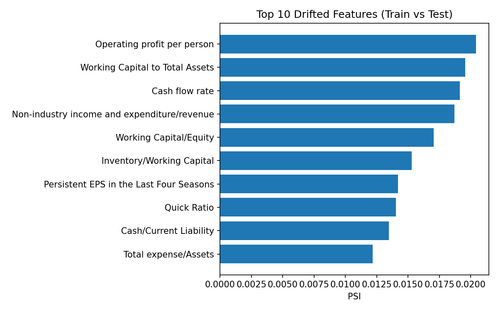

# Bankruptcy Prediction - Lab 5 Report

## Jot Notes (aligned with Lab 4)

### EDA
- Kept extreme ratio values as signal; only remove if clear data error.
- Checked distributions and correlations to inform correlation filter.
- No categoricals; focused on numeric hist/box/heatmap.
- EDA confirmed no missing values in typical Kaggle copy; we still check.

### Preprocessing
- StandardScaler only for Logistic Regression; trees use raw values.
- Applied correlation filter at 0.9 to reduce redundancy.
- Stratified split to preserve class ratio.
- Feature set reduced by XGB importance to ~40 features.

### Imbalance
- Severe imbalance (~3% positive): class_weight='balanced' for LR.
- SMOTE used inside CV folds for RF and XGB only on training folds.
- scale_pos_weight used for XGBoost as extra help.
- All splits are stratified.

### Feature Selection
- Step 1: drop |corr|≥0.9 twins.
- Step 2: keep top-k by XGB importance (k=40).
- Keeps training fast and reduces overfitting risk.
- Retains interpretability for SHAP.

### Hyperparameter Tuning
- RandomizedSearchCV (25 iters) with StratifiedKFold(5).
- Scoring on ROC-AUC to handle imbalance.
- Same procedure across models for fairness.
- Fixed random_state for reproducibility.

### Evaluation
- Reported ROC-AUC, PR-AUC, F1, and Brier on train & test.
- Plotted ROC and calibration curves overlaying train vs. test.
- Saved a clean metrics.csv sorted by test ROC-AUC.
- Watched for overfitting gaps between train and test.

### SHAP
- Computed SHAP on best model (tree-based).
- Included summary plot for global feature effects.
- Supports stakeholder explanations and compliance.
- If SHAP fails, warn but continue (robust pipeline).

### PSI
- Computed PSI train vs. test for drift.
- Flag: PSI > 0.25 suggests significant shift.
- Saved top-20 PSI features to csv for review.
- Guides retraining/monitoring plans.

### Challenges & Reflections
- Balancing imbalanced classes without overfitting took tuning.
- Keeping runtime reasonable: used RandomizedSearchCV.
- Calibrating probabilities while maximizing AUC is a trade-off.
- Correlation filter chosen over PCA to keep interpretability.

## Metrics Summary (Train vs Test)

| model              |   roc_auc_train |   roc_auc_test |   pr_auc_train |   pr_auc_test |   brier_train |   brier_test |   f1_train |   f1_test |
|:-------------------|----------------:|---------------:|---------------:|--------------:|--------------:|-------------:|-----------:|----------:|
| RandomForest       |        0.999933 |       0.95167  |       0.998116 |      0.538535 |     0.0140509 |    0.0376555 |   0.836105 |  0.484848 |
| XGBoost            |        0.995058 |       0.943939 |       0.842588 |      0.50756  |     0.0565275 |    0.0763303 |   0.463768 |  0.352941 |
| LogisticRegression |        0.937969 |       0.89041  |       0.353995 |      0.300258 |     0.111681  |    0.110295  |   0.293893 |  0.305085 |

## Plots
- EDA: `eda_histograms.png`, `eda_boxplots.png`, `eda_corr_heatmap.png`
- ROC curves: saved per model in `plots/`
- Calibration curves: saved per model in `plots/`
- SHAP: `shap_summary.png`
- PSI Top Drift Table: `psi_top.csv`

## Selected Features (top 20 shown)

| feature                                                 |
|:--------------------------------------------------------|
| Persistent EPS in the Last Four Seasons                 |
| Borrowing dependency                                    |
| Debt ratio %                                            |
| Retained Earnings to Total Assets                       |
| Total debt/Total net worth                              |
| Total income/Total expense                              |
| Quick Ratio                                             |
| Net Value Per Share (B)                                 |
| Interest Expense Ratio                                  |
| Non-industry income and expenditure/revenue             |
| Accounts Receivable Turnover                            |
| Contingent liabilities/Net worth                        |
| Current Liabilities/Equity                              |
| ROA(C) before interest and depreciation before interest |
| Allocation rate per person                              |
| Interest-bearing debt interest rate                     |
| Net Income to Stockholder's Equity                      |
| Cash Turnover Rate                                      |
| Equity to Liability                                     |
| Quick Assets/Current Liability                          |

Full list saved at `selected_features.csv`.

## Best Hyperparameters

Saved at `best_params.json`.

```
{
  "LogisticRegression": {
    "clf__solver": "lbfgs",
    "clf__penalty": "l2",
    "clf__C": 0.001
  },
  "RandomForest": {
    "clf__n_estimators": 300,
    "clf__min_samples_split": 2,
    "clf__min_samples_leaf": 4,
    "clf__max_features": "log2",
    "clf__max_depth": null
  },
  "XGBoost": {
    "clf__subsample": 0.7,
    "clf__reg_lambda": 10.0,
    "clf__n_estimators": 200,
    "clf__min_child_weight": 10,
    "clf__max_depth": 5,
    "clf__learning_rate": 0.05,
    "clf__gamma": 0.3,
    "clf__colsample_bytree": 1.0
  }
}
```

## PSI (Train vs Test)

| feature                                     |       psi |
|:--------------------------------------------|----------:|
| Operating profit per person                 | 0.0204195 |
| Working Capital to Total Assets             | 0.0195718 |
| Cash flow rate                              | 0.0191449 |
| Non-industry income and expenditure/revenue | 0.0186975 |
| Working Capital/Equity                      | 0.0170454 |
| Inventory/Working Capital                   | 0.0152987 |
| Persistent EPS in the Last Four Seasons     | 0.0141977 |
| Quick Ratio                                 | 0.0140224 |
| Cash/Current Liability                      | 0.013476  |
| Total expense/Assets                        | 0.0121751 |



## Deployment Recommendation

- **Recommend:** RandomForest — highest test ROC-AUC and strong PR-AUC with best calibration (lowest Brier) among candidates.
- **Rationale:** Test ROC-AUC ≈ 0.952, PR-AUC ≈ 0.539, Brier ≈ 0.038.
- **Next step before production:** Calibrate probabilities (Isotonic/Platt) and choose a threshold by cost-sensitive analysis. Keep PSI monitoring (alert if PSI > 0.25) and retrain if drift persists.
